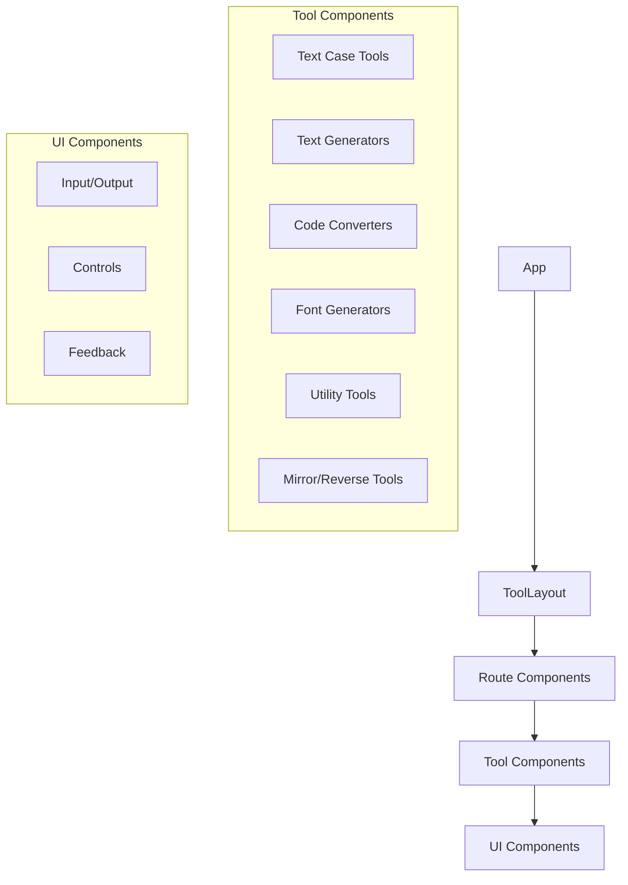
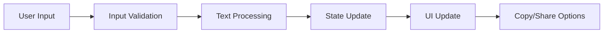

# System Patterns

## Architecture Overview

### Component Structure


## Design Patterns

### Component Patterns
1. **Tool Layout Pattern**
   - Flexible layout wrapper for all tools.
   - Provides consistent UI structure across tools (padding, background).
   - Includes an optional header controlled via the `hideHeader` prop.
   - **Convention:** When a tool component (e.g., `CsvToJsonConverter`) is rendered within the main application layout (`MainLayout`), it should pass `hideHeader={true}` to `ToolLayout` to prevent duplicate headers. The `MainLayout` already provides the primary site navigation.
   - Handles shared input/output elements if needed (though often managed within the specific tool component).
   - Can include configurable navigation elements if used standalone (not typical in this project).

2. **Text Processing Pattern**
   - Input validation
   - Text transformation
   - Result presentation
   - Clipboard integration

3. **State Management**
   - Component-level state
   - Controlled inputs
   - Error state handling
   - UI state preferences

### Layout Patterns
1. **Header Management**
   - Optional header visibility
   - Configurable navigation elements
   - Consistent branding
   - Responsive design

2. **Tool Interface Pattern**
   - Clean, focused interfaces
   - Essential controls only
   - Consistent spacing and alignment
   - Adaptive layouts

### File Organization
```
src/
├── components/
│   ├── layout/       # Layout components (ToolLayout)
│   ├── tools/        # Tool implementations
│   └── ui/          # Reusable UI components
├── data/            # Configuration
├── lib/             # Utilities
└── types/           # TypeScript types
```

## Implementation Standards

### Tool Component Structure
- Standard props interface
- Header visibility control
- Error handling
- Loading states
- Clipboard integration
- Input validation

### UI Component Integration
- Radix UI primitives
- Tailwind styling
- Consistent theming
- Accessibility support
- Flexible header management

### Data Flow


## Technical Decisions

### Technology Choices
- React for component framework
- TypeScript for type safety
- Tailwind for styling
- Radix UI for accessible components
- Vite for development/build

### Layout Strategy
- Flexible header control
- Component-based layouts
- Responsive design patterns
- Consistent tool interfaces

### Performance Considerations
- Component-level code splitting
- Efficient text processing
- Optimized re-renders
- Lazy loading where appropriate
- Minimal UI overhead

### Testing Strategy
- Component unit tests
- Layout integration tests
- Header visibility tests
- Accessibility testing
- Performance benchmarks
