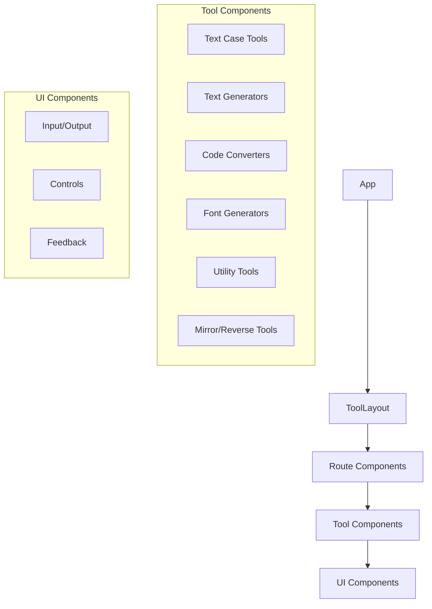
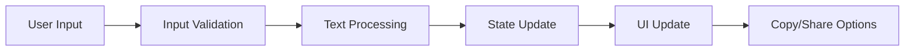
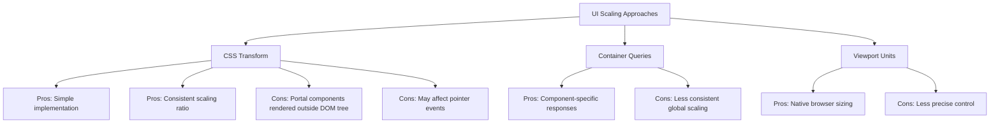

# System Patterns

## Architecture Overview

### Component Structure


## Design Patterns

### Component Patterns
1. **Tool Layout Pattern**
   - Flexible layout wrapper for all tools.
   - Provides consistent UI structure across tools (padding, background).
   - Includes an optional header controlled via the `hideHeader` prop.
   - **Convention:** When a tool component (e.g., `CsvToJsonConverter`) is rendered within the main application layout (`MainLayout`), it should pass `hideHeader={true}` to `ToolLayout` to prevent duplicate headers. The `MainLayout` already provides the primary site navigation.
   - Handles shared input/output elements if needed (though often managed within the specific tool component).
   - Can include configurable navigation elements if used standalone (not typical in this project).

2. **Text Processing Pattern**
   - Input validation
   - Text transformation
   - Result presentation
   - Clipboard integration

3. **State Management**
   - Component-level state
   - Controlled inputs
   - Error state handling
   - UI state preferences

### Layout Patterns
1. **Header Management**
   - Optional header visibility
   - Configurable navigation elements
   - Consistent branding
   - Responsive design

2. **Tool Interface Pattern**
   - Clean, focused interfaces
   - Essential controls only
   - Consistent spacing and alignment
   - Adaptive layouts

### File Organization
```
src/
├── components/
│   ├── layout/       # Layout components (ToolLayout)
│   ├── tools/        # Tool implementations
│   └── ui/          # Reusable UI components
├── data/            # Configuration
├── lib/             # Utilities
└── types/           # TypeScript types
```

## Implementation Standards

### Tool Component Structure
- Standard props interface
- Header visibility control
- Error handling
- Loading states
- Clipboard integration
- Input validation

### UI Component Integration
- Radix UI primitives
- Tailwind styling
- Consistent theming
- Accessibility support
- Flexible header management

### Data Flow


## Technical Decisions

### Technology Choices
- React for component framework
- TypeScript for type safety
- Tailwind for styling
- Radix UI for accessible components
- Vite for development/build

### Layout Strategy
- Flexible header control
- Component-based layouts
- Responsive design patterns
- Consistent tool interfaces

### UI Scaling Approaches


#### CSS Transform Implementation
- Uses scale transform with variable scale factors
- Scale factors defined in CSS variables for easy updates
- Media queries for responsive behavior across devices:
  - Desktop (min-width: 768px): 70% scale (var(--app-scale): 0.7)
  - Tablet (max-width: 767px, min-width: 481px): 85% scale
  - Mobile (max-width: 480px): 100% scale (no scaling)
- Transform origin set to "top center" for predictable expansion
- Width compensation using calc(100% / var(--app-scale))
- Special handling for portal-based components (dialogs, popovers)

### Performance Considerations
- Component-level code splitting
- Efficient text processing
- Optimized re-renders
- Lazy loading where appropriate
- Minimal UI overhead
- Transform-based scaling impacts rendering performance less than re-layout approaches

### Testing Strategy
- Component unit tests
- Layout integration tests
- Header visibility tests
- Accessibility testing
- Performance benchmarks
- Cross-device rendering consistency tests
- Portal component scaling verification

### Portal Component Challenges
```mermaid
graph TD
    A[DOM Structure] --> B[Main DOM Tree]
    A --> C[Portal Components]
    
    B --> B1[Affected by #root scaling]
    C --> C1[Rendered outside main DOM tree]
    C --> C2[Require separate scaling rules]
    
    C2 --> D1[Component-specific selectors]
    C2 --> D2[Role-based targeting]
    C2 --> D3[State attributes]
    
    D1 --> E1[.DrawerContent, .CommandDialog]
    D2 --> E2[[role="dialog"], [role="menu"]]
    D3 --> E3[[data-state="open"]]
```
